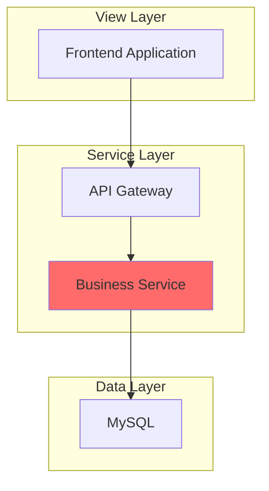
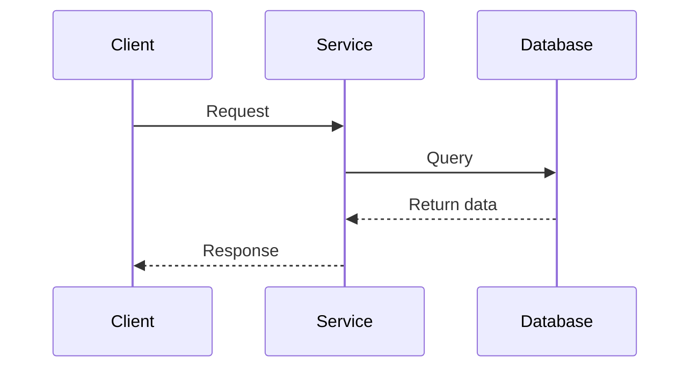
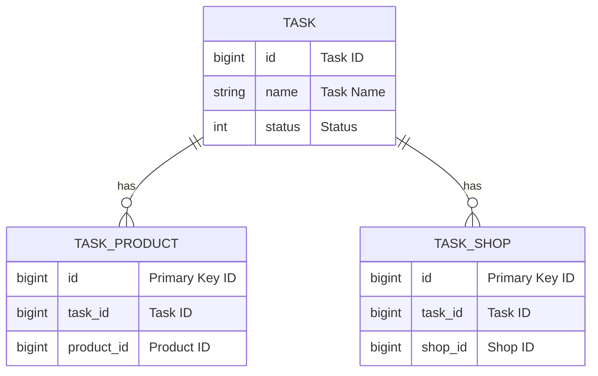

# Technical Design Document Template

> **Note**: The overall structure is fixed. Section titles and order must not be modified, merged, added, or deleted. Generate content for each section according to this template.

> **⚠️ Important - No Code Implementation Required**:
> - This is a **design document**, not implementation code
> - Focus on **what to change**, not **how to write code**
> - Describe changes at architecture/module/interface level, not line-by-line code
> - Examples show data structures and interfaces, not implementation logic

> ⚠️ **Important - Mermaid Syntax Requirements (Target version: 9.1.x)**:
> - **All diagrams use Mermaid** (flowchart uses `graph TD`, sequenceDiagram, erDiagram, stateDiagram-v2)
> - **Node text must use double quotes**: `A["Text"]` instead of `A[Text]` (avoids parsing errors with special characters)
> - **Arrow types**: Only use `-->` (solid), `-.->` (dashed), `==>` (thick)
>   - ❌ **Forbidden**: `-,->`, `--x`, `--o`, `-x` (these cause syntax errors)
> - **Arrow labels must be simple**: `A -->|Label| B` (only letters, numbers, spaces, and basic punctuation `,`, `.`, `-`)
>   - ❌ **Forbidden**: Square brackets `[Old Flow]`, angle brackets `<br/>`, special symbols
>   - ✅ **Correct**: `A -.->|Old Flow| B`
> - **ER diagram decimal type**: Use `decimal` without parameters (avoid `decimal(10,2)` causing syntax errors)
> - **Subgraph avoid square brackets**: `subgraph Title` instead of `subgraph Name[Text]`

## Business Background

- 📌 **Objective**: One sentence describing the core goal (e.g., metric improvement, architecture upgrade, feature delivery), plus a paragraph on "measurable targets"
- 🔗 **Document References**: `PRD links / Requirement pool / Design mockups`
- **Forbidden**: Grand narratives, irrelevant background descriptions

## Feature Module Division

Use a table to clearly divide core modules, prioritize **feature modules** by importance, and describe each module's functionality and changes:

Constraints:
- Each row must correspond to a change ID in [Change Scope] section
- Do not expand implementation details here, only provide module-level descriptions

**Priority Reference:**
- 🔴 P0: Blocking release
- 🟠 P1: Feature critical
- 🟡 P2: Experience optimization

📌 **Example**

| **Feature Module (Priority)** | **Feature Points** | Change Type (New/Modified/Deleted) | Dependent Services |
| --- | --- | --- | --- |
| User Submission Module (🔴 P0) | Task submission support | Deleted | None |
|   | xxx | New | Frontend |
| Content Generation Module (🟠 P1) | Call LLM to generate images/videos | New | LLM |
|   | Call LLM to generate images/videos | New | Config Center |
| Matrix Gateway (🟡 P2) | Integrate unified queue management | Modified | Gateway Management |

### Use Case Diagram (Optional)

If insufficient information to draw a use case diagram, provide a "Role/Use Case" list in this subsection:

**Role Examples**
- Role A (User): Submit requests, view results, query history, etc.
- Role B (System Administrator): Configuration management, access control, system maintenance
- Role C (Optional, special role): [Define as needed]

If sufficient information is available, use a simple Mermaid flowchart to express main use case relationships (not mandatory).

## Detailed Design

> This section expands by subsections: Architecture Diagram / Flow Chart / Swimlane Diagram / Sequence Diagram / State Diagram / Domain Model / Core Changes / Interface Definitions / Schema Definitions.

### Overall Architecture Diagram (Required)

Use Mermaid graph to draw the system architecture diagram, describing overall system architecture and module dependencies. **Forbid using flow/sequence elements**.

- If [Input Information] completely lacks architecture information → Output `⚠ To be supplemented: Missing architecture information` + reason
- Otherwise, draw a basic architecture diagram, can be degraded to skeleton version

Must cover:
- Layers: View Layer | Access Layer | Service Layer | Infrastructure | Storage | External Dependencies (add/remove as needed)
- Core modules and changed modules (highlight with red style: `style ModuleName fill:#ff6b6b`)

Example:


### Business Flow Diagram (Required)

Use Mermaid to draw the business flow diagram

- If [Input Information] completely lacks business flow → Output `NO-FLOW-H` + reason
- Otherwise, draw according to "General Drawing Specifications · Flowchart", can be degraded to skeleton version

Must cover:
- Starting point: Start → Entry service
- Middle: Decision / Aggregation / Dispatch / Async processing
- End point: Result write / Scheduled task / Callback
- Highlight changed nodes in red, old flows with gray dashed lines + `[Old Flow]`
- Include at least one exception path

### Sequence Diagram (Required)

Use Mermaid sequenceDiagram to draw the sequence diagram with the following requirements:

- Only keep key RPC call logic, DB operations, ES operations, Redis and other storage operations
- For Overpass calls, use package names (e.g., tiktok_local_alliance_task.RawCall.UpdateTaskBatchComplete finds local_alliance_task project) in current path to locate corresponding project code. If not found, only record the method called; if found, read the code and record specific operations, same logic as above
- Sequence diagram nodes only keep Overpass RPC and various storage like DB, ES, Redis. For RPC, keep project name (e.g., local_alliance_task)
- Express key information in English
- Use Mermaid syntax, example:



### State Diagram (Optional)

Use Mermaid to draw state machine transition diagram

- If insufficient information for state transitions: List main states + trigger events in bullet form, mark "State diagram to be supplemented"

Must cover:
- Initial state, multiple intermediate states, terminal/closed state
- Exception states (failure/cancel/suspend) entry and exit paths

### Domain Model (Optional)

#### ER Diagram

Use Mermaid erDiagram to draw ER diagram, must cover:

- Core entity list, field list
- Primary key / Foreign key relationships, 1:1 / 1:N / N:M descriptions
- Tables and fields affected by this change (mark new/modified/deleted)
- Draw all fields and clearly express relationships
- Add comments for each field; if comments are too long, keep only simplified content
- Use Mermaid syntax, example:



### Core Changes

Use **bullet points** to list **core changes for this requirement** (new, adjusted, deleted features, interface changes, data structure changes, etc.).

> **Note**: Describe **WHAT** changes, not **HOW** to implement code. Focus on architecture decisions, not code snippets.

Expand by change point, each change point uses unified template:

#### **[Change Point Name]**

- **[Change Overview]**: ≤2 sentences, explain purpose / core changes (must align with feature points in Section 2 "Feature Module Division" table)
- **[What Changes]**: Describe what will be modified (e.g., "Add new caching layer", "Change authentication flow", "Remove deprecated API endpoint") - **NO code implementation**
- **[Change Location]**: Specify affected file / module / service name / data table / configuration item (at least 1 specific path or key)
- **[Change Type]**: New / Modified / Deleted
- **[Rollback Method]**: Configuration switch / Switch back to old flow / Rollback version, etc. (executable actions)
- **[Monitoring Points]**: Interfaces / Metrics / Events to monitor

### 🔌 Interface Definitions

This section describes API and RPC interface changes involved in this requirement, focusing on IDL/Schema changes.

Output format should be clear with complete fields, and supplement IDL field meanings (type, required/optional, field description).

- Output **change-related** interface changes, showing **new/modified** fields and parameter descriptions
- **Highlight interface definition changes** with field annotations (e.g., required fields, type descriptions, etc.)
- Include **API interface changes**, **RPC interface changes**, etc.
- **For new interfaces, add caller/callee descriptions** and **return value examples**

IDL definition source repository: https://code.byted.org/tiktok/service_rpc_idl

**Output Format Requirements:**
- Must strictly follow the format below
- Field structure must supplement field descriptions (type + explanation) for (new or modified or deleted) fields
- Maintain the format

#### API Interfaces

Interfaces affected by this requirement and corresponding IDL changes, need to be highlighted

📌 **Example**

##### [Interface Name] (New/Modified/Deleted)

| **Property** | **Value** |
| --- | --- |
| **path** | /commerce/v3/benefits/batch_check_withhold_deduct |
| **http_method** | POST |
| **description** | Batch check deduction benefit interface |

**Request Structure (Thrift IDL)**:
```thrift
struct BatchCheckDeductBenefitReq {
    1: required BaseParam BaseParam
    2: required string Biz

    255: base.Base Base
}
```

**Response Structure (Thrift IDL)**:
```thrift
struct BatchCheckDeductBenefitRsp {
    1: CheckDeductStatus Status

    255: base.BaseResp BaseResp
}
enum CheckDeductStatus {
    Success = 1,
    Fail = 2,
}
struct BenefitConsumptionResult {
    1: required SingleBenefitTriplet BenefitTriplet
}
```

#### RPC Interfaces

Interfaces affected by this requirement, supplement the table below. For IDL (Thrift protocol) changes, need to be highlighted

##### [Interface Name] (New/Modified/Deleted)

| **Property** | **Value** |
| --- | --- |
| **psm** | faceu.commerce.consumption |
| **method** | BatchCheckDeductBenefit |
| **description** | Batch check deduction benefit RPC interface |
| **timeout** | 500ms |
| **retry** | 3 times |

**Request Structure (Thrift IDL)**:
```thrift
struct BatchCheckDeductBenefitReq {
    1: required BaseParam BaseParam
    2: required string Biz
    3: list<BenefitConsumptionTriplet> ConsumptionList
    4: bool Strict
    5: CheckDeductActionType ActionType
    6: optional string SubmitID
    7: optional list<ClientCheckGroup> ClientCheckGroup  // Client verification identity
    8: optional i64 AuthType       // 1. Usage auth, 2. Export auth, default usage auth
    9: optional string RiskInfo     // Risk control request info, JSON format

    255: base.Base Base
}
```

**Response Structure (Thrift IDL)**:
```thrift
struct BatchCheckDeductBenefitRsp {
    1: CheckDeductStatus Status
    2: CheckDeductActionType ActionType
    3: list<BenefitConsumptionResult> ConsumptionResultList
    4: optional PayWall PayWall

    255: base.BaseResp BaseResp
}
enum CheckDeductStatus {
    Success = 1,
    Fail = 2,
}
struct BenefitConsumptionResult {
    1: required SingleBenefitTriplet BenefitTriplet
    2: required string HistoryID
    3: optional string HistroyExtra
    4: optional i64 CreditsAmount
    5: CheckDeductStatus Status
    // Consumed benefit type, same value as paymode: LimitFree, UserCredit...
    6: list<string> ConsumeTypes
}
```

### Schema Definitions

This section describes DB / MQ / Cache / Configuration Center / Experiment Configuration schema changes involved in this requirement.

#### Database Tables (If DB changes involved)

For scenarios involving database changes, supplement as needed

📌 **Example**

##### [Table Name]

| **Item** | **Content** |
| --- | --- |
| **Table Name** | adra_execute_education_task |
| **Description** | Education task record table for user education unlock flow |
| **Data Estimate** | ~100 rows/month, long-term storage |
| **Idempotent** | Yes, primary key is task ID |
| **Change Impact** | Whether data migration needed, pre-launch tasks |

**Table Structure DDL:**

```sql
CREATE TABLE `adra_execute_education_task` (
  `id` bigint unsigned NOT NULL COMMENT 'Primary key',
  `scene_id` bigint unsigned NOT NULL COMMENT 'Scene ID',
  `platform_type` int DEFAULT NULL COMMENT 'Tenant type',
  `target_id` bigint unsigned NOT NULL COMMENT 'User ID',
  `room_id` bigint unsigned NOT NULL DEFAULT '0' COMMENT 'Room ID',
  `education_task_id` bigint unsigned NOT NULL COMMENT 'Education task ID',
  `education_task_record_id` bigint unsigned NOT NULL COMMENT 'Education task record ID, identifies one education session',
  `punish_record_id` bigint unsigned NOT NULL DEFAULT '0' COMMENT 'Punishment request ID',
  `punish_ticket_id` bigint unsigned NOT NULL DEFAULT '0' COMMENT 'Punishment ticket ID',
  `create_time` timestamp NOT NULL DEFAULT CURRENT_TIMESTAMP COMMENT 'Creation time',
  `update_time` timestamp NOT NULL DEFAULT CURRENT_TIMESTAMP ON UPDATE CURRENT_TIMESTAMP COMMENT 'Update time',
  `task_deadline` datetime NOT NULL COMMENT 'Task deadline',
  `state` int NOT NULL DEFAULT '0' COMMENT 'Status 1-Dispatched successfully 2-Dispatch failed 3-Learning passed 4-Learning failed 5-Abandoned learning 6-Timeout',
  `extra` json DEFAULT NULL COMMENT 'Extra information',
  `param` json DEFAULT NULL COMMENT 'Business parameters',
  `tag_id` bigint unsigned NOT NULL COMMENT 'Tag ID',
  `education_action` varchar(128) COLLATE utf8mb4_general_ci NOT NULL DEFAULT '' COMMENT 'Education action: education_block, education_notice',
  PRIMARY KEY (`id`),
  KEY `idx_target_id` (`target_id`),
  KEY `idx_task_record_id` (`education_task_record_id`),
  KEY `idx_task_deadline` (`task_deadline`),
  KEY `idx_tag_id` (`tag_id`)
) ENGINE=InnoDB DEFAULT CHARSET=utf8mb4 COLLATE=utf8mb4_general_ci COMMENT='Education unlock task table';
```

#### MQ Message Definitions (If MQ involved)

For scenarios involving MQ messages, supplement as needed

📌 **Example**

##### [Message Name]

| **Item** | **Content** |
| --- | --- |
| **Topic** | lv.commerce.benefit_v2.expire |
| **Purpose** | Notify downstream benefit expiration for cleanup |
| **Message Format** | JSON (structure below) |
| **Consumption Method** | RocketMQ, unicast consumption |
| **Consumption Idempotency** | Consumer must implement idempotency |
| **QPS** | Very low (passively triggered) |

**Message Body Definition (Go Struct):**

```go
type BaseBenefitIDListMsg struct {
    Uid                    string  `json:"uid"`
    Biz                    string  `json:"biz"`
    BenefitAssetItemIDList []int64 `json:"benefit_asset_item_id_list"`
    Remark                 string  `json:"remark"`
}
```

#### Cache Structure (If involved)

For scenarios involving cache, supplement as needed

📌 **Example**

##### [Cache Name]

| **Item** | **Content** |
| --- | --- |
| **Key Example** | aigc:batch:<task_id> |
| **Type** | Hash |
| **TTL** | 24 hours |
| **Value Example** | {"user_id":123, "status":"done"} |
| **Purpose** | Store user task intermediate state for polling or lookup |

#### TCC Configuration Center (If TCC involved)

For scenarios involving configuration center, supplement as needed

📌 **Example**

| **Config Item** | **Type** | **Default Value** | **Example Value** | **Purpose** |
| --- | --- | --- | --- | --- |
| [Config Item] | json | `{}` | `{ "max_concurrent": 5 }` | Extended business parameter configuration |

## TODO Items

(Prioritized by color):

- 🔴 High
  - [ ] Add caching logic to avoid repeated scheduling
  - [ ] Set interface call timeout parameter (3s)
- 🟠 Medium
  - [ ] Supplement input parameter validation logic
- 🟡 Low
  - [ ] Unified error handling encapsulation module
  - [ ] Write boundary and exception tests
  - [ ] Update interface definition documentation
